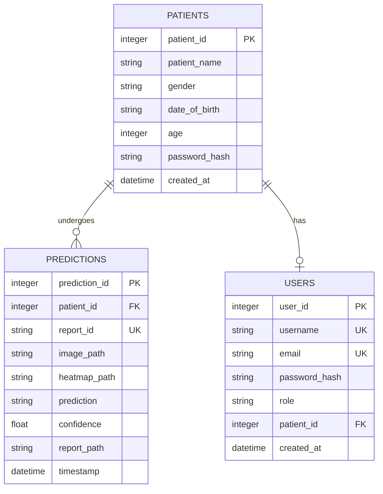

# GSTNet™ Gallstone Detection System — System Reference & Documentation

This document serves as a comprehensive reference detailing the system architecture, database design, API specifications, security protocols, and front-end layouts implemented for the GSTNet Gallstone Detection System.

---

## 1. System Architecture Overview

The GSTNet platform leverages a hybrid deep learning + handcrafted feature extraction pipeline for clinical-grade classification of gallbladder ultrasound images.

### Diagnostic Inference Pipeline
1.  **Handcrafted Texture Branch**: Fuses Local Binary Patterns (LBP) with Grey-Level Co-occurrence Matrix (GLCM) statistics to produce a 24-dimensional texture feature vector mapping fine-grain echogenicity and shadow signatures.
2.  **Deep Spatial Branch**: Leverages convolutional neural network (CNN) feature extraction blocks.
3.  **Dual Attention Module**: Refines combined features via sequential spatial and channel attention weights.
4.  **Grad-CAM Explainability Module**: Computes gradients at the final convolutional layer to map spatial areas of diagnostic influence, projecting them as transparent overlays on original ultrasound imagery.

---

## 2. Secure Patient Access & Privacy Design

To uphold patient data privacy and prevent unauthorized access to clinical reports, the system isolates public patient interfaces from private administrative logs.

### Access Authentication Boundary
*   **No Public Account Creation**: Patients do not establish permanent diagnostic portal accounts.
*   **On-the-fly Secure Registration**: When submitting a new ultrasound scan, the patient's demographic details (Name, Gender, DOB, Age) and a new **Access Password** are collected.
*   **Report Access Authentication**: Retrieving diagnostic results requires providing three distinct, matching factors:
    *   `Report ID` (format: `GST-YYYYMMDD-XXXX`)
    *   `Date of Birth` (format: `YYYY-MM-DD`)
    *   `Password` (securely validated against hashed storage)
*   **Verification Rule**: Access is granted only when:
    $$\text{Report ID} \land \text{Date of Birth} \land \text{Password} \implies \text{Authorized}$$

---

## 3. Database Schema

The SQLite database (`database/gstnet.db`) structures relations between demographics, clinical runs, and administrative accounts.



### Table Specifications

#### A. `patients` Table
Stores secure patient profiles. Password hashes are salted and hashed via SHA-256 before insertion.
*   `patient_id` (INTEGER, Primary Key, Autoincrement)
*   `patient_name` (VARCHAR, Non-nullable, Indexed)
*   `gender` (VARCHAR, Non-nullable)
*   `date_of_birth` (VARCHAR, Nullable)
*   `age` (INTEGER, Non-nullable)
*   `password_hash` (VARCHAR, Nullable, Encrypted)
*   `created_at` (DATETIME, Default: UTC Now)

#### B. `predictions` Table
Logs individual diagnostic runs, generated Report IDs, and file system URLs.
*   `prediction_id` (INTEGER, Primary Key, Autoincrement)
*   `patient_id` (INTEGER, Foreign Key referencing `patients.patient_id`, Cascade Delete)
*   `report_id` (VARCHAR, Unique, Nullable, Indexed)
*   `image_path` (VARCHAR, Non-nullable)
*   `heatmap_path` (VARCHAR, Nullable)
*   `prediction` (VARCHAR, Non-nullable)
*   `confidence` (FLOAT, Non-nullable)
*   `report_path` (VARCHAR, Nullable)
*   `timestamp` (DATETIME, Default: UTC Now)

#### C. `users` Table
Manages doctor/admin clinical portal accounts.
*   `user_id` (INTEGER, Primary Key, Autoincrement)
*   `username` (VARCHAR, Unique, Non-nullable, Indexed)
*   `email` (VARCHAR, Unique, Non-nullable, Indexed)
*   `password_hash` (VARCHAR, Non-nullable)
*   `role` (VARCHAR, Non-nullable, Default: "patient")
*   `patient_id` (INTEGER, Foreign Key referencing `patients.patient_id`, Set Null)
*   `created_at` (DATETIME, Default: UTC Now)

---

## 4. API Endpoints Reference

All endpoints are hosted relative to `/api` (default port: `5000`).

### A. Patient Diagnostics & Predictions
*   **`POST /predict`**
    *   *Purpose*: Creates patient profile, executes GSTNet classification, generates Grad-CAM heatmaps, outputs unique Report ID, and compiles PDF report.
    *   *Form Data Parameters*:
        *   `patient_name` (string, required)
        *   `age` (integer, required)
        *   `gender` (string, required)
        *   `date_of_birth` (string, required, format: `YYYY-MM-DD`)
        *   `password` (string, required)
        *   `confirm_password` (string, required)
        *   `image` (file, required, ultrasound scan image)
    *   *Response (200 OK)*:
        ```json
        {
          "success": true,
          "patient": { "patient_id": 9, "patient_name": "Ravi Kumar", ... },
          "prediction": {
            "prediction_id": 6,
            "report_id": "GST-20260531-0001",
            "prediction": "Gallstone",
            "confidence": 0.92,
            "report_path": "/reports/report_GST-20260531-0001.pdf",
            "image_path": "/uploads/uuid.jpg",
            "heatmap_path": "/uploads/uuid_heatmap.jpg"
          }
        }
        ```

*   **`POST /generate-report-id`**
    *   *Purpose*: Queries sequence counters of the active calendar date and generates the next chronological unique Report ID (e.g. `GST-20260531-0002`).

### B. Secure Report Retrieval & Recovery
*   **`POST /patient-report-access`**
    *   *Purpose*: Authenticates and retrieves patient records securely.
    *   *JSON Request Parameters*:
        *   `report_id` (string, required)
        *   `date_of_birth` (string, required)
        *   `password` (string, required)
    *   *Response (200 OK)*: Returns patient details, diagnostic predictions, Grad-CAM images, and PDF download path.
    *   *Response (401 Unauthorized)*: `{"success": false, "message": "Invalid Report ID, Date of Birth, or Password."}`

*   **`POST /forgot-password`**
    *   *Purpose*: Verifies identity mapping before password reset.
    *   *JSON Request Parameters*:
        *   `report_id` (string, required)
        *   `patient_name` (string, required)
        *   `date_of_birth` (string, required)
    *   *Response (200 OK)*: `{"success": true, "message": "Verification successful.", "patient_id": 9}`

*   **`POST /reset-password`**
    *   *Purpose*: Updates the patient's hashed credentials.
    *   *JSON Request Parameters*:
        *   `patient_id` (integer, required)
        *   `password` (string, required)
        *   `confirm_password` (string, required)
    *   *Response (200 OK)*: `{"success": true, "message": "Password reset successful."}`

### C. Clinical Administration Portal
*   **`POST /login`**: Clinical/Admin staff login using database-backed accounts. Demo fallback: `admin / admin123`.
*   **`POST /register`**: Clinical/Admin account registration. Requires secret clinic code `GSTNET-ADMIN-2026`.
*   **`GET /history`**: Returns full patient prediction registries. Accessible exclusively to authenticated Doctors/Admins. Supports text search, prediction filter, and sorting.
*   **`DELETE /delete-prediction/<id>`**: Deletes historical diagnostic runs and removes associated upload files, heatmaps, and compiled PDFs from disk.
*   **`GET /metrics`**: Serves training metrics JSON models from storage.

---

## 5. Front-End Redesign Specification

The frontend uses React and Ant Design (v5). Pages are structurally partitioned based on public/private security contexts.

### A. Public Client Interfaces (Standalone Views)
*   **Landing Page (`Home.jsx`)**: Renders modern, bright CTA cards directing users to **New Diagnosis** or **Patient Report Access**, with a navigation doorway to the clinical portal.
*   **New Diagnosis Portal (`UploadScan.jsx`)**: Features a split-screen design. Upload actions are locked until demographics, Date of Birth, and password matching are validated. Completing the run opens the **Result Panel** displaying the unique **Report ID**, classification outcomes, Grad-CAM textures, and PDF download pathways.
*   **Patient Report Access (`PatientReport.jsx`)**: Prominently gates lookup on Report ID, Date of Birth, and Password. Integrates the multi-step modal-based **Password Recovery Portal** to securely recover and reset passwords on matching demographics.

### B. Private Clinical Portal Interfaces (Sidebar Layout)
*   **Sidebar Layout (`SidebarLayout.jsx`)**: Context-aware admin wrapper displaying Dashboard, Run Diagnosis, Patient Logs, and About pages. Restricts navigation using local storage authentication.
*   **Dashboard (`Dashboard.jsx`)**: Focuses on key system statistics (total caseloads, normal study distributions, and caseload monthly trends).
*   **Patient Logs (`History.jsx`)**: Interactive table showing historical scans with "Review" and "PDF download" actions. The search controls include a live text search box and gender filter dropdown.

---

## 6. Verification and Maintenance

### Automated Tests (`test_access.py`)
Features a Python-based automated testing suite validating all secure access APIs. It automatically:
1.  Flashes a randomized mock ultrasound JPG.
2.  Submits a prediction with on-the-fly demographic registration and password hash generation.
3.  Validates success cases of `/api/patient-report-access` on matching variables.
4.  Validates correct rejection of incorrect passwords (401).
5.  Executes the `/api/forgot-password` verification steps.
6.  Updates passwords via `/api/reset-password` and ensures that the updated password works while the old password is rejected.

### Running Local Development Environment
1.  **Backend (Python Flask)**:
    *   Virtual Environment: `.venv`
    *   Run: `$env:PYTHONPATH="."; .\venv\Scripts\python backend/app.py`
    *   API Port: `5000`
2.  **Frontend (Vite React)**:
    *   Install Dependencies: `npm install`
    *   Run: `npm run dev`
    *   App Port: `5173`
